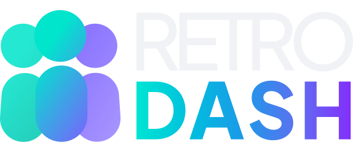

<div align="center">
  
  <p><em>Reflect Together. Improve Always.</em></p>

  
  
  
  
  
</div>

---

RetroDash is a real-time retrospective platform for Scrum and Kanban teams. Teams run structured retrospectives inside private, password-protected rooms — adding cards, voting on what matters most, and closing with clear action items. No setup calls. No per-seat pricing. Just open a room and start reflecting.

## Features

- **Private rooms** — Password-protected spaces where teams can speak freely. Share a room code and password; no uninvited observers.
- **Real-time collaboration** — Cards, votes, and status updates appear instantly for every participant via Firestore `onSnapshot`. No refreshing.
- **Anonymous mode** — Optionally hide card authors so teammates can give honest feedback without hesitation.
- **Action items** — Capture outcomes directly on the board with a dedicated Action Items column.
- **Carry-over items** — Import uncompleted action items from a previous retro into the current one without any copy-pasting.
- **AI card improvement** — A built-in Gemini-powered suggestion rewrites a card to be clearer and more actionable with one click.
- **Retro summary** — A post-retro summary view groups all cards and action items, ready for export (PDF / Notion, coming soon).
- **Multilingual** — Full UI in English and Brazilian Portuguese (`next-intl`). Locale is auto-detected and URL-prefixed.

## Tech Stack

| Layer | Technology |
|---|---|
| Framework | [Next.js 16](https://nextjs.org) (App Router) |
| Language | TypeScript 5 |
| Styling | Tailwind CSS v4 |
| Auth | Firebase Authentication — Google OAuth only |
| Database | Firebase Firestore (realtime via `onSnapshot`) |
| AI | Google Generative AI (Gemini) |
| i18n | next-intl v4 |
| Hosting | Vercel |

## Getting Started

### Prerequisites

- Node.js 20+
- A [Firebase project](https://console.firebase.google.com) with **Authentication** (Google provider) and **Firestore** enabled
- A [Google AI Studio](https://aistudio.google.com) API key (for the AI card improvement feature)

### Environment variables

Create a `.env.local` file at the project root:

```env
NEXT_PUBLIC_FIREBASE_API_KEY=
NEXT_PUBLIC_FIREBASE_AUTH_DOMAIN=
NEXT_PUBLIC_FIREBASE_PROJECT_ID=
NEXT_PUBLIC_FIREBASE_STORAGE_BUCKET=
NEXT_PUBLIC_FIREBASE_MESSAGING_SENDER_ID=
NEXT_PUBLIC_FIREBASE_APP_ID=
NEXT_PUBLIC_GEMINI_API_KEY=
```

> [!CAUTION]
> Never commit `.env.local` to version control. It is already listed in `.gitignore` by default.

### Run locally

```bash
npm install
npm run dev
```

Open [http://localhost:3000](http://localhost:3000). Sign in with Google to access the dashboard.

### Build for production

```bash
npm run build
npm run start
```

Deploy to Vercel by pushing to your main branch — Vercel's Next.js integration handles the rest. Set the environment variables in your Vercel project settings.

## Application Flow

```
/                       → redirects to /dashboard (auth) or /login (guest)
/login                  → Google OAuth sign-in
/dashboard              → lists rooms you created or joined
/room/new               → create a room (name, password, columns, anonymous toggle)
/room/[roomId]          → the live retro board (facilitator controls status)
/room/[roomId]/summary  → post-retro recap with all cards and action items
```

Participants join by entering a room code and password. The room creator is automatically the **facilitator** and can start, pause, or end the retro. Everyone else joins as a **member**.

## Project Structure

```
retrodash/
├── app/
│   └── [locale]/           # i18n-prefixed routes (en / pt-BR)
│       ├── (auth)/login/
│       ├── (app)/
│       │   ├── dashboard/
│       │   ├── room/new/
│       │   └── room/[roomId]/
│       │       └── summary/
│       └── layout.tsx
├── components/
│   ├── board/              # Board, Column, Card
│   ├── room/               # JoinRoom, NewRoom, Summary, Share, CarryOver
│   ├── landing/            # Marketing page sections
│   └── ui/                 # Reusable primitives (Button, Input, Modal, etc.)
├── hooks/                  # useAuth, useRoom, useCards, useParticipants, …
├── lib/                    # firebase.ts, auth.ts, firestore.ts
├── i18n/                   # next-intl routing and request config
├── messages/               # en.json, pt-BR.json
└── types/                  # Shared TypeScript interfaces
```

> [!NOTE]
> All Firestore mutations live in `lib/firestore.ts`. Components never call Firestore directly — they go through the hooks in `hooks/`.

## Roadmap

**Phase 1 — MVP (in progress)**

- [x] Project scaffold (Next.js + TypeScript + Tailwind + Firebase)
- [x] Google Auth flow
- [x] Dashboard (created and joined rooms)
- [x] Create and join room flow
- [x] Real-time retro board (columns + cards)
- [x] Voting system
- [x] Action items column
- [x] Carry-over action items
- [x] AI card improvement (Gemini)
- [x] Retro summary page
- [x] Multilingual support (EN / PT-BR)
- [ ] PDF export

**Phase 2+**

More ideas are in the works. Have a suggestion? Open an issue — contributions and feedback are welcome.
